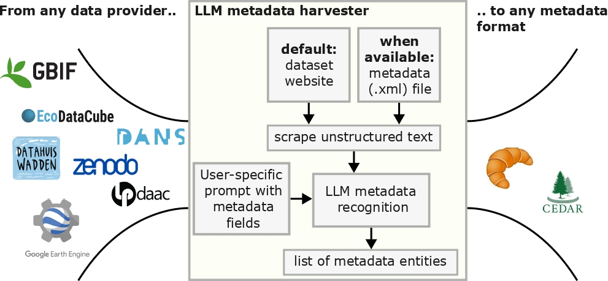

# llm-metadata-harvester


> **Paper Title:** Flexible metadata harvesting for ecology using large language models
>
> **Authors:** Zehao Lu [0009−0001−6518−2744], Thijs L van der Plas [0000−0001−5490−1785], Parinaz Rashidi [0000−0002−0898−0942], W Daniel Kissling [0000−0002−7274−6755], and Ioannis N Athanasiadis [0000−0003−2764−0078]
>
> **Conference/Journal:** EcoDL 2025 Workshop
>
> **DOI / arXiv:** [Link to paper](https://...)

---

## 📦 Repository Overview

This repository contains the official implementation of the paper:  
**"Flexible metadata harvesting for ecology using large language models"**, presented at **EcoDL 2025 Workshop**.

### 🔍 Abstract



Large, open datasets can accelerate ecological research, particularly by enabling researchers to develop new insights by reusing datasets from across different sources. However, in order to find the most suitable datasets to combine, researchers have to navigate diverse ecological and environmental data provider platforms with varying metadata availability and standards. To overcome this obstacle, we have developed a large language model (LLM)-based metadata harvester that flexibly extracts metadata from any dataset landing page, and converts these to a user-defined, unified format. We validate that our tool is able to extract both structured and unstructured metadata with equal accuracy, aided by our LLM post-processing protocol. Further, we use LLMs to identify links between datasets, either using embedding similarity or by converting extracted metadata to ontologies. Therefore, our tool -- flexibly linking the metadata of different datasets -- can be used for graph-based queries, for example for finding relevant ecological and environmental datasets in a virtual research environment.

---

## 🧱 Folder Structure

```bash
.
├── src/                # Sourc code
├── models/             # Pre-trained or saved models
├── results/            # Output logs, figures, or evaluation metrics
├── imgs/               # Images
├── requirements.txt    # Python dependencies
└── README.md           # This file
